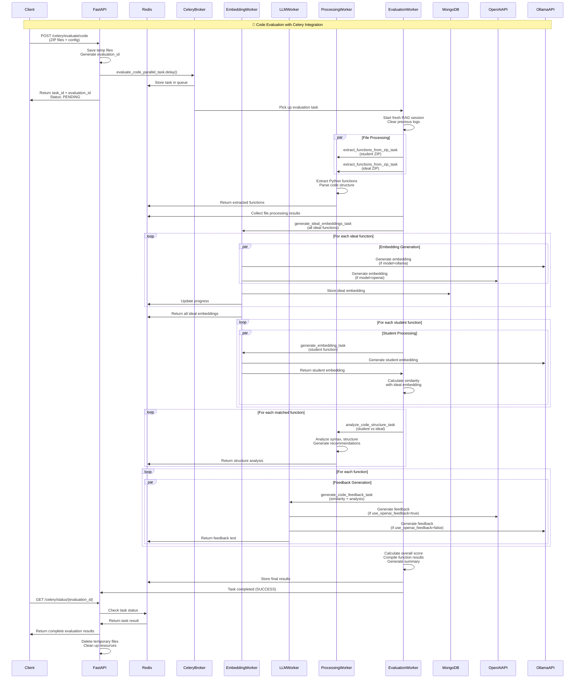
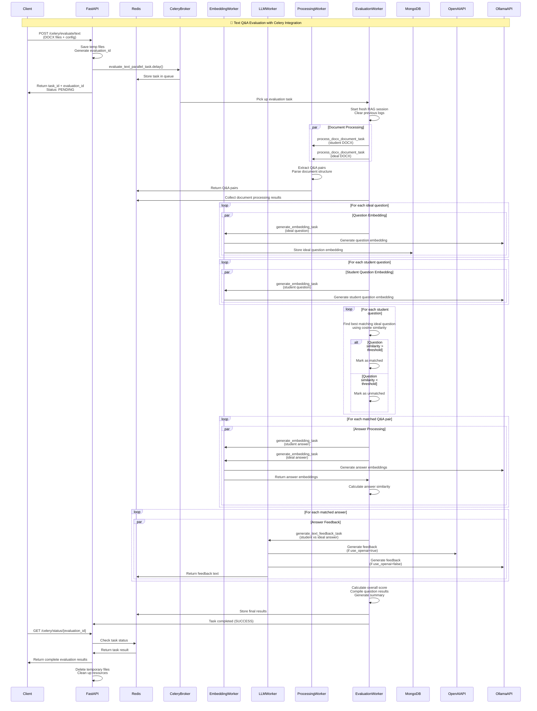
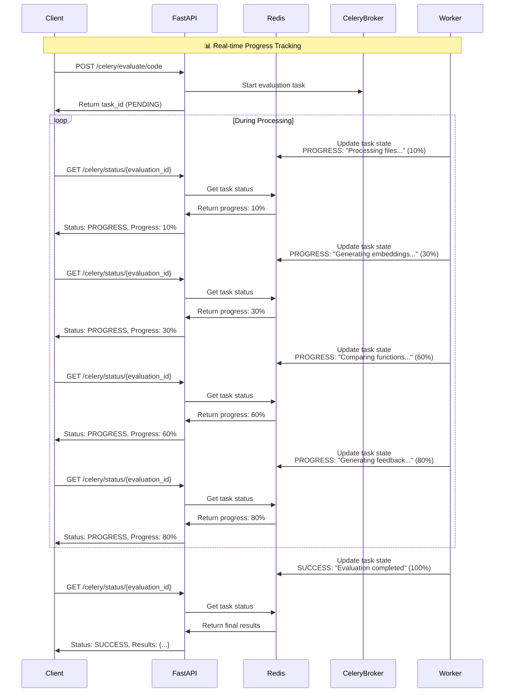
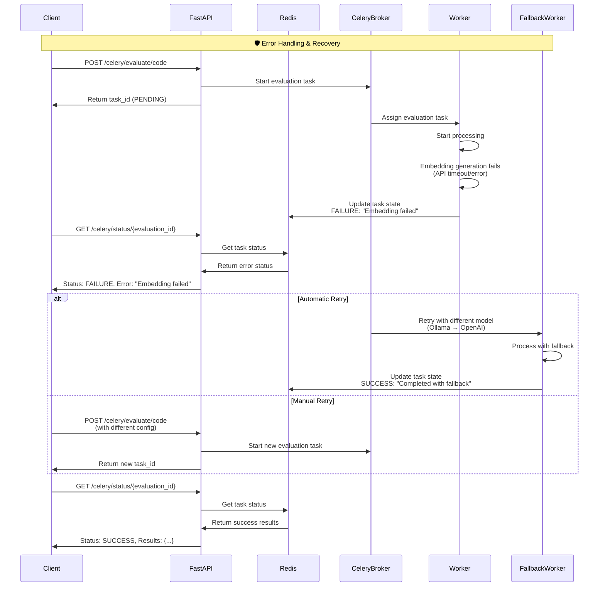
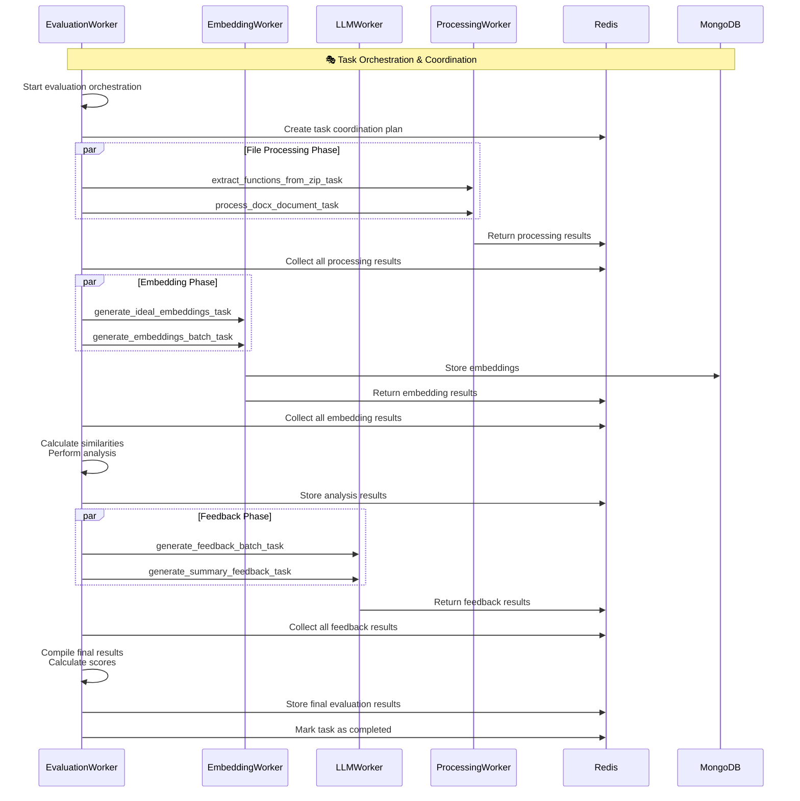
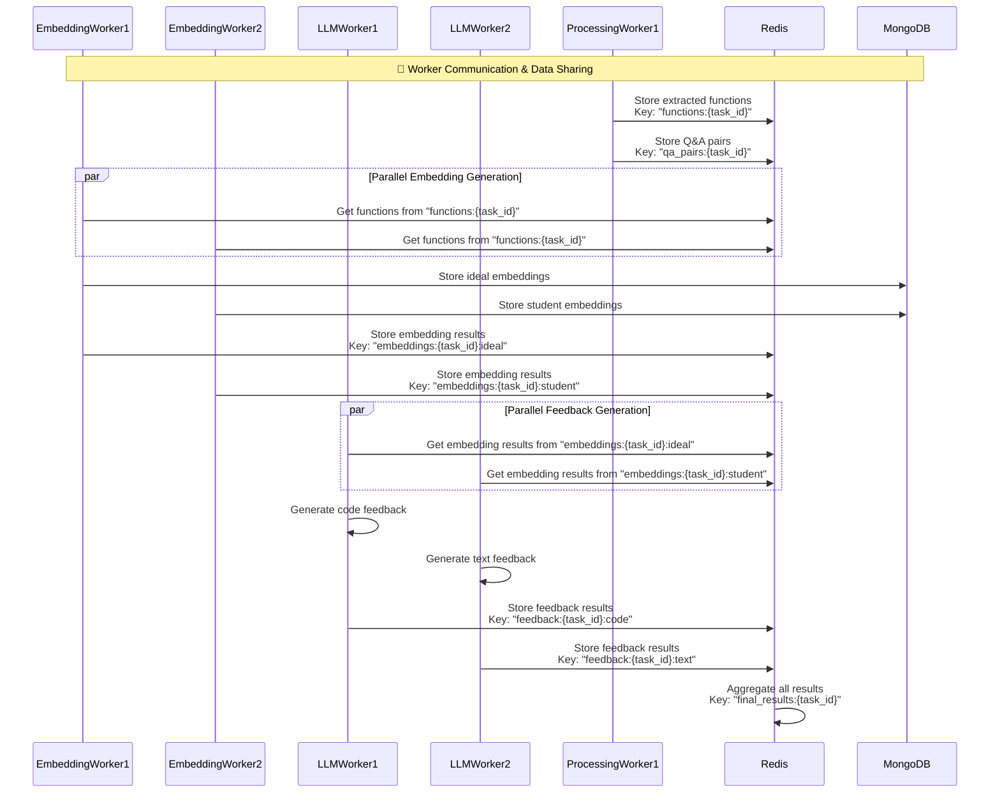
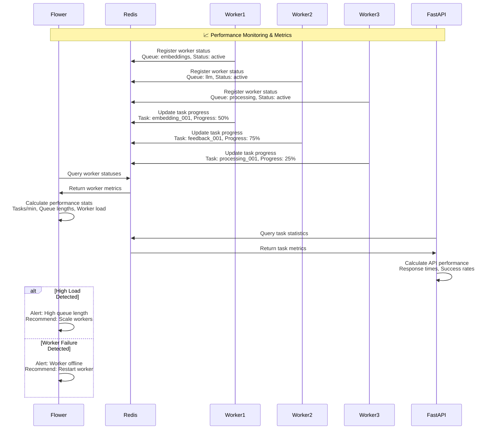
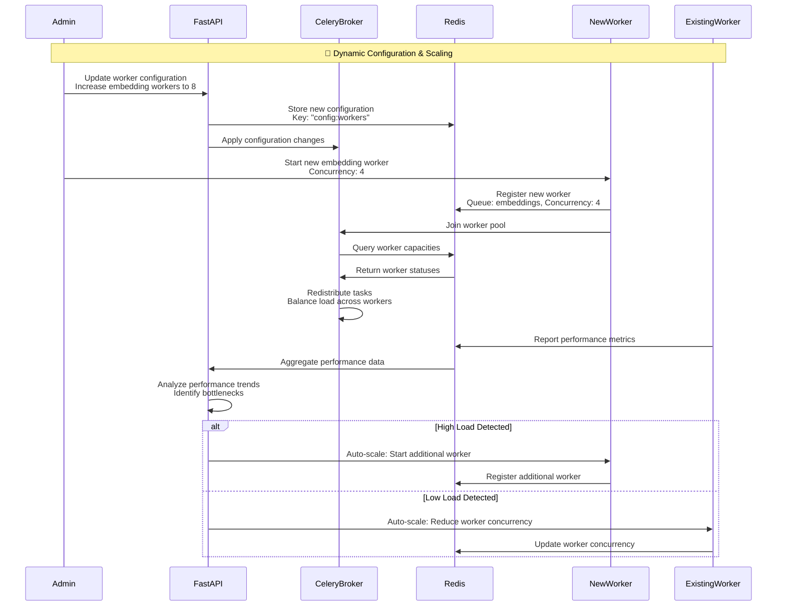

# Celery Integration Sequence Diagrams

This document contains detailed sequence diagrams showing the complete flow of Celery integration in the AI Assignment Evaluator project.

## 📋 **Table of Contents**

1. [Complete Code Evaluation Flow](#complete-code-evaluation-flow)
2. [Text Q&A Evaluation Flow](#text-qa-evaluation-flow)
3. [Progress Tracking Flow](#progress-tracking-flow)
4. [Error Handling & Recovery Flow](#error-handling--recovery-flow)
5. [Task Orchestration Flow](#task-orchestration-flow)
6. [Worker Communication Flow](#worker-communication-flow)

---

## 🚀 **Complete Code Evaluation Flow**

This diagram shows the complete flow of a code evaluation using Celery, from initial request to final results.

---

## 📄 **Text Q&A Evaluation Flow**

This diagram shows the complete flow of a text Q&A evaluation using Celery.

---

## 📊 **Progress Tracking Flow**

This diagram shows how real-time progress tracking works throughout the evaluation process.

---

## 🛡️ **Error Handling & Recovery Flow**

This diagram shows how the system handles errors and implements recovery mechanisms.

---

## 🎭 **Task Orchestration Flow**

This diagram shows how different types of workers coordinate to complete complex evaluations.

---

## 🔄 **Worker Communication Flow**

This diagram shows how different worker types communicate and share data through Redis.

---

## 📈 **Performance Monitoring Flow**

This diagram shows how the system monitors performance and resource usage.

---

## 🔧 **Configuration & Scaling Flow**

This diagram shows how the system can be configured and scaled dynamically.

---

## 📝 **Notes**

### **Key Benefits Shown in These Diagrams:**

1. **Parallel Processing**: Multiple workers can process different parts simultaneously
2. **Fault Tolerance**: Error handling and recovery mechanisms are built-in
3. **Progress Tracking**: Real-time status updates throughout the process
4. **Resource Management**: Workers can be scaled dynamically based on load
5. **Data Sharing**: Redis acts as a central coordination point for all workers
6. **Monitoring**: Comprehensive monitoring and alerting capabilities

### **Performance Improvements:**

- **Sequential Processing**: 1 task at a time
- **Parallel Processing**: 10+ tasks simultaneously
- **Speed Improvement**: 3-4x faster evaluations
- **Scalability**: Horizontal scaling across multiple machines
- **Reliability**: Automatic retry and fallback mechanisms

### **Use Cases:**

- **Single Evaluation**: Use synchronous endpoints for simple cases
- **Batch Evaluations**: Use Celery for multiple concurrent evaluations
- **Production Deployments**: Use Celery for high-availability systems
- **Development/Testing**: Use synchronous endpoints for quick testing
