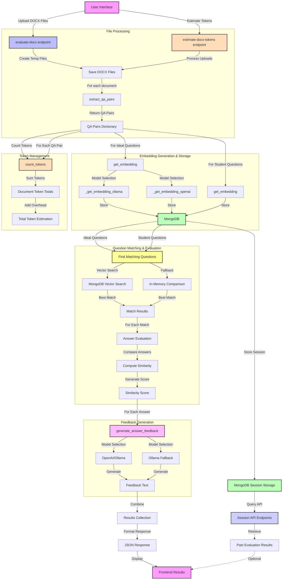

# Document Evaluation System - Process Flow

## Overview
This document explains the document evaluation flow in the AI Assignment Checker project, which compares student text document submissions against reference documents using AI embeddings, similarity matching, and feedback generation.

## Document Evaluation Flow Diagram


## Document Processing and Embedding Lifecycle

### Document Upload and QA Extraction
1. At the beginning of document evaluation:
   ```python
   # Save uploaded files to temporary storage
   ideal_path = f"temp_ideal_{file.filename}"
   student_path = f"temp_student_{submission_file.filename}"
   
   # Extract question-answer pairs from both documents
   ideal_qa_pairs = docx_processor.extract_qa_pairs(ideal_path)
   student_qa_pairs = docx_processor.extract_qa_pairs(student_path)
   ```
   - DOCX files are saved to temporary storage
   - QA pairs are extracted using the DocxProcessor
   - Each QA pair consists of a question and its corresponding answer

### Embedding Generation and Storage
1. For each question in the reference document:
   ```python
   # Generate embeddings for ideal questions
   for qa_id, qa_data in ideal_qa_pairs.items():
       question_text = qa_data.get("question", "")
       embedding = get_embedding(question_text, model)
       
       # Store in MongoDB with session ID
       store_qa_embedding(
           session_id, qa_id, question_text, 
           qa_data.get("answer", ""),
           embedding, is_ideal=True
       )
   ```
   - Questions from the reference document get converted to embeddings
   - Embeddings are stored in MongoDB with metadata
   - The session_id links all embeddings for a specific evaluation

2. For each question in the student document:
   ```python
   # Process each student question
   for student_qa_id, qa_data in student_qa_pairs.items():
       student_question = qa_data.get("question", "")
       student_answer = qa_data.get("answer", "")
       student_embedding = get_embedding(student_question, model)
       
       # Store in MongoDB
       store_qa_embedding(
           session_id, student_qa_id, student_question,
           student_answer, student_embedding, is_ideal=False
       )
   ```
   - Student question embeddings are also generated and stored
   - Unlike code evaluation, both reference and student embeddings are stored permanently
   - This enables retrieval of past evaluation results

### MongoDB Data Persistence
1. **Persistent Storage Model**:
   ```python
   def store_qa_embedding(session_id, qa_id, question, answer, embedding, is_ideal=True):
       """Store QA embedding in MongoDB with proper metadata."""
       client = get_mongodb_client()
       collection = client.get_collection("qa_embeddings")
       
       document = {
           "session_id": session_id,
           "type": "ideal" if is_ideal else "student",
           "qa_id": qa_id,
           "question": question,
           "answer": answer,
           "embedding": embedding.tolist(),
           "timestamp": datetime.utcnow()
       }
       
       collection.insert_one(document)
   ```
   - Unlike code evaluation, embeddings are not deleted between sessions
   - Each session has a unique ID (typically based on the reference filename)
   - All data is organized by session for easy retrieval

2. **Session API Endpoints**:
   - `/docx-sessions` - List all evaluation sessions
   - `/docx-results/{session_id}` - Get specific session results
   - `/docx-session/{session_id}` - Delete a session and its data

## Main Flow

### 1. Initial Request
- User accesses the Text Q&A Evaluation tab in the web interface
- The interface allows uploading two DOCX files:
  - Reference document (ideal)
  - Student submission
- User can select:
  - Embedding model (Ollama or OpenAI)
  - Whether to use OpenAI for enhanced feedback generation
- Token estimation is performed when files are selected

### 2. Token Estimation Process (`/estimate-docx-tokens` endpoint)
1. Files are uploaded and processed
2. QA pairs are extracted from both documents
3. Tokens are counted for each question and answer
4. Token estimation includes:
   - All questions and answers from both documents
   - Overhead for embeddings (1,024 tokens per embedding)
   - Overhead for QA mapping (2,000 tokens)
   - Feedback generation overhead (5,000 tokens)
5. Total token estimate is calculated
6. UI is updated with token information and warnings if needed

### 3. Evaluation Process (`/evaluate-docx` endpoint)

#### 3.1 File Processing
1. `evaluate_docx()` function receives the uploaded files
2. Creates temporary files for both DOCX documents
3. Creates a unique session ID based on the reference filename
4. Initializes MongoDB connection for embedding storage

#### 3.2 QA Pair Extraction
1. `docx_processor.extract_qa_pairs()`:
   - Opens DOCX document using python-docx
   - Applies parsing strategies to identify Q&A pairs:
     - Structured parsing: Looks for "Q:" and "A:" prefixes
     - Sequential parsing: Falls back to paragraph alternation
   - Returns dictionary of QA pairs with unique IDs

#### 3.3 Embedding Generation and Question Matching
1. For reference document:
   - Iterates through each question
   - Generates and stores embeddings in MongoDB

2. For student document:
   - Generates embeddings for each question
   - For each student question:
     - Attempts to find matching reference question
     - Uses vector search in MongoDB when available
     - Falls back to in-memory cosine similarity calculation
     - Identifies best match based on highest similarity

#### 3.4 Answer Comparison
1. For each matched question pair:
   - Computes similarity between student answer and reference answer
   - Similarity score ranges from 0-1 (1 being identical)
   - Answer is considered correct if similarity ≥ 0.8
   - Partial credit given based on similarity score

#### 3.5 Feedback Generation
1. For each answer:
   - Generates personalized feedback based on:
     - Student's answer text
     - Reference answer text
     - Similarity score
   - Feedback options:
     - OpenAI: High-quality feedback using GPT models
     - Ollama: Local model feedback with lower resource requirements
   - Feedback includes:
     - Assessment of answer quality
     - Missing key points
     - Suggestions for improvement

#### 3.6 Results Storage and Response
1. Results are compiled into a structured format:
   ```python
   results = {
       "status": "success",
       "session_id": session_id,
       "matched_questions": len(processed_questions),
       "average_similarity": avg_similarity,
       "processed_questions": processed_questions,
       "model_used": str(model)
   }
   ```

2. All match results are stored in MongoDB for future retrieval
3. Results are returned to the frontend for display
4. Temporary files are deleted to free resources

## MongoDB Integration

### 1. Vector Storage and Retrieval
- **Implementation**: Uses MongoDB vector search capabilities
- **Purpose**: Efficiently find similar questions across documents
- **Process**:
   ```python
   # Vector search query
   pipeline = [
       {"$search": {
           "index": "qa_embeddings_vector",
           "knnBeta": {
               "vector": query_embedding.tolist(),
               "path": "embedding",
               "k": 5,
               "filter": {
                   "session_id": session_id,
                   "type": "ideal"
               }
           }
       }},
       {"$project": {
           "question": 1,
           "answer": 1,
           "qa_id": 1,
           "score": {"$meta": "searchScore"}
       }}
   ]
   ```
- **Fallback**: In-memory comparisons when vector search is unavailable

### 2. Session Management
- **Implementation**: Session-based organization of data
- **Purpose**: Allow retrieval of past evaluation results
- **Process**:
   - Each evaluation creates a unique session ID
   - All data is tagged with this session ID
   - API endpoints enable querying by session ID
   - Sessions can be listed, retrieved, or deleted

## Error Handling Strategy

### 1. Document Processing Errors
- Handles malformed documents gracefully
- Provides clear feedback on document format issues
- Falls back to alternative parsing methods when primary fails

### 2. Database Connection Issues
- Checks MongoDB connection status before operations
- Gracefully falls back to in-memory processing when needed
- Returns descriptive error messages for database failures

### 3. Embedding Generation Failures
- Attempts multiple embedding models when primary fails
- Logs detailed information about embedding failures
- Returns partial results when possible

## Performance Considerations

### 1. Embedding Reuse
- Embeddings are stored persistently to avoid regeneration
- Sessions can be reused for multiple evaluation cycles
- Significant performance improvement for repeated evaluations

### 2. Vector Search Optimization
- MongoDB vector search provides efficient similarity matching
- Indexes are created automatically at startup
- Search is limited to specific session data for efficiency

### 3. Parallel Processing
- Question matching and answer evaluation can be parallelized
- Token counting happens in parallel for efficiency
- Feedback generation is the most time-consuming operation

## Integration with Code Evaluation

The Document Evaluation system is designed to complement the Code Evaluation functionality:

1. **Shared Infrastructure**:
   - Both systems use the same embedding models
   - They share MongoDB for data storage (different collections)
   - Common token counting and estimation logic

2. **Key Differences**:
   - Document evaluation stores both reference and student embeddings
   - Sessions are persistent (not deleted between evaluations)
   - Question matching replaces function matching
   - Answer similarity replaces code similarity

3. **UI Integration**:
   - Unified interface with tabs for different evaluation types
   - Consistent token estimation and feedback display
   - Similar loading indicators and error messages 