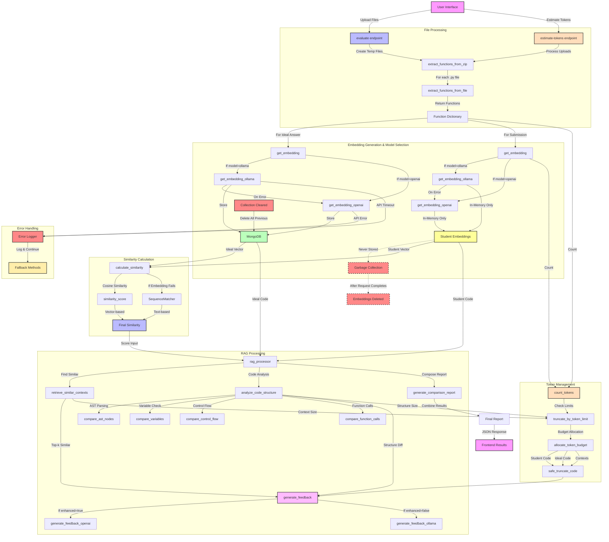

# AI Assignment Checker - Function Calling Flow

## Overview
This document explains the function calling flow in the AI Assignment Checker project, which evaluates student submissions against ideal answers using semantic similarity comparison through embeddings and Retrieval-Augmented Generation (RAG).

## Function Call Flow Diagram


### Function Interaction Highlights

The diagram above illustrates several important function interactions in the AI Assignment Checker:

1. **Model Selection Logic**: 
   - Primary embedding generation through specified model (Ollama or OpenAI)
   - Fallback mechanisms between models when errors occur
   - Different handling for ideal answers (stored) vs. student submissions (in-memory only)

2. **Similarity Calculation Pipeline**:
   - Vector-based similarity using cosine distance as primary method
   - Text-based similarity using SequenceMatcher as fallback when embedding generation fails
   - Multiple comparison methods feeding into final similarity score

3. **Detailed RAG Components**:
   - Code structure analysis with specialized comparisons for:
     - Variables and variable usage patterns
     - Control flow structures (if/else, loops, etc.)
     - Function calls and parameters
     - AST node structure and relationships
   - Retrieval of similar contexts based on embedding similarity
   - Feedback generation with model-specific implementations
   - Comprehensive report generation combining all analysis results

4. **Robust Token Management**:
   - Token counting for all text components
   - Safe truncation of code maintaining syntax validity
   - Dynamic budget allocation based on component importance
   - Token limit enforcement to prevent API errors

5. **Error Handling Flow**:
   - API timeout and error detection
   - Logging of errors with appropriate context
   - Fallback mechanisms to ensure service continuity
   - Proper cleanup of temporary resources

## Embedding Generation and Lifecycle

### Initial Database Clearing
1. At the beginning of each evaluation, all previous embeddings are deleted:
   ```python
   collection.delete_many({})
   ```
   - This ensures a clean slate for each new evaluation
   - Prevents cross-contamination between different sessions
   - Removes any historical data from previous evaluations

### Ideal Answer Embedding Generation and Storage
1. For each function in the ideal answer:
   ```python
   for name, code in ideal_funcs.items():
       embedding = get_embedding(code, model)
       rag_processor.store_code_context(
           name, code, embedding, 
           {"is_ideal": True, "timestamp": datetime.utcnow()}
       )
       ideal_embeddings[name] = embedding
   ```
   - Embeddings are generated using the selected model (Ollama or OpenAI)
   - Each function's embedding is stored in MongoDB for the current session
   - The embeddings are also kept in memory in the `ideal_embeddings` dictionary

### Student Submission Embedding Generation (On-the-Fly)
1. For each function in the student submission that matches an ideal function:
   ```python
   if func_name in submission_funcs:
       student_code = submission_funcs[func_name]
       student_embedding = get_embedding(student_code, model)
       
       # Use RAG processor for comparison
       comparison_report = rag_processor.generate_comparison_report(
           student_code, ideal_funcs[func_name],
           student_embedding, ideal_embeddings[func_name]
       )
   ```
   - Student embeddings are generated on-the-fly only when needed
   - They exist only in memory (local variable `student_embedding`)
   - They are **never** stored in MongoDB
   - They are passed to the RAG processor for immediate comparison

### Embedding Lifecycle and Deletion
1. **Temporary MongoDB Storage**:
   - Only ideal answer embeddings are stored in MongoDB
   - This storage is temporary (just for the current evaluation session)
   - Cleared at the start of the next evaluation with `collection.delete_many({})`

2. **Student Embedding Lifecycle**:
   - Student embeddings are created as local variables during processing
   - They exist only for the duration of the request
   - They are automatically garbage-collected when the request completes
   - No explicit deletion is needed as they were never stored persistently

3. **Session Isolation**:
   - Each evaluation session operates in isolation
   - No knowledge is transferred between sessions
   - Each comparison starts with a fresh database

This transient approach to embedding management has significant implications for the RAG system's effectiveness, as detailed in the LIMITATIONS.md document. The primary limitation is that the system cannot learn from or leverage past student submissions since those embeddings are never persistently stored.

## Similarity Calculation Process

The system employs a sophisticated approach to calculating code similarity:

1. **Primary Method: Vector Similarity**
   ```python
   def calculate_similarity(text1, text2, embedding_model="ollama"):
       try:
           # Generate embeddings based on selected model
           embedding1 = get_embedding(text1, embedding_model)
           embedding2 = get_embedding(text2, embedding_model)
           
           # Calculate cosine similarity between vectors
           similarity = 1 - cosine(embedding1, embedding2)
           logger.info(f"Calculated similarity: {similarity}")
           return similarity
       except Exception as e:
           # Fallback to text-based similarity if embedding fails
           logger.error(f"Error calculating vector similarity: {e}")
           return text_similarity_fallback(text1, text2)
   ```

2. **Fallback Method: Text-Based Similarity**
   ```python
   def text_similarity_fallback(text1, text2):
       # Use SequenceMatcher as a fallback
       matcher = SequenceMatcher(None, text1, text2)
       similarity = matcher.ratio()
       logger.info(f"Fallback similarity calculated: {similarity}")
       return similarity
   ```

3. **Error Handling**:
   - Embedding API errors are caught and logged
   - System gracefully degrades to text-based similarity
   - Results are normalized to ensure consistency

This dual-approach ensures robust similarity measurement even when embedding services encounter issues.

## RAG Implementation Details

### 1. Retrieval Component
- **Implementation**: `retrieve_similar_contexts()` in the RAG processor
- **Purpose**: Find semantically similar code implementations to the submitted function
- **Process**:
  - Uses MongoDB to store and retrieve code embeddings
  - Computes similarity between query embedding and stored embeddings
  - Returns top-k most similar implementations
- **Strengths**:
  - Provides context for better similarity assessment
  - Enables example-based feedback
  - Improves comparison accuracy
- **Limitations**:
  - Currently limited to embeddings from the current session
  - Does not maintain long-term knowledge base
  - Quality depends on the embedding model's effectiveness

### 2. Augmentation Component
- **Implementation**: `_analyze_code_structure()` and supporting methods
- **Purpose**: Enhance the comparison with structural code analysis
- **Process**:
  - Parses code using AST for both student and ideal solutions
  - Compares variables, control flow, and function calls
  - Identifies missing or extra elements
- **Strengths**:
  - Adds syntactic understanding to semantic comparison
  - Provides specific, actionable insights
  - Not dependent on embedding quality
- **Limitations**:
  - Limited to syntactic features
  - Cannot assess algorithm quality or efficiency
  - Doesn't understand semantic equivalence of different structures

### 3. Generation Component
- **Implementation**: `generate_feedback()` with model-specific implementations
- **Purpose**: Produce human-readable feedback on code submissions
- **Process**:
  - Takes student code, ideal code, structure analysis, and similar contexts
  - Formats a prompt with all relevant information
  - Calls either OpenAI or Ollama API for text generation
  - Manages token usage to stay within model limits
- **Strengths**:
  - Provides detailed, contextualized feedback
  - Leverages LLM capabilities for natural language explanation
  - Combines semantic, structural, and example-based insights
- **Limitations**:
  - Dependent on external API availability
  - Quality varies between OpenAI and Ollama
  - Token limitations may truncate context

### 4. Code Structure Analysis
The `_analyze_code_structure()` method implements a multi-faceted approach to comparing code structure:

```python
def _analyze_code_structure(self, student_code, ideal_code):
    """Analyze the structure of student code compared to ideal code."""
    student_ast = ast.parse(student_code)
    ideal_ast = ast.parse(ideal_code)
    
    analysis = {
        "variables": self._compare_variables(student_ast, ideal_ast),
        "control_flow": self._compare_control_flow(student_ast, ideal_ast),
        "function_calls": self._compare_function_calls(student_ast, ideal_ast),
        "ast_diff": self._compare_ast_nodes(student_ast, ideal_ast)
    }
    
    return analysis
```

Each specialized comparison method focuses on a different aspect of code structure:
- `_compare_variables`: Identifies missing, extra, and differently used variables
- `_compare_control_flow`: Analyzes loops, conditionals, and their nesting patterns
- `_compare_function_calls`: Examines function invocations and their arguments
- `_compare_ast_nodes`: Performs a general structural comparison of AST nodes

The resulting analysis provides a comprehensive view of structural similarities and differences.

## Token Management Implementation

### 1. Token Counting and Budgeting
- **Implementation**: `utils.tokenizer_utils` module
- **Purpose**: Ensure prompts stay within LLM context limits (100k tokens)
- **Process**:
  - Uses `tiktoken` to accurately count tokens
  - Allocates token budget for different components:
    - Student code (max 15,000 tokens)
    - Ideal code (max 15,000 tokens)
    - Structure analysis (~5,000 tokens)
    - Similar contexts (variable, allocated from remaining budget)
    - Response space (reserved 20,000 tokens)
- **Strengths**:
  - Prevents API errors from token overflow
  - Prioritizes essential content
  - Dynamic allocation based on content size
- **Limitations**:
  - Fixed overhead estimates may not be accurate for all cases
  - May truncate useful content in very large submissions

### 2. Token Estimation UI
- **Implementation**: `/estimate-tokens` endpoint and JavaScript
- **Purpose**: Provide real-time feedback on token usage
- **Process**:
  - Triggered when files are selected
  - Extracts functions and counts tokens
  - Displays total count and breakdown
  - Provides visual feedback on token safety
- **Strengths**:
  - Improves user experience with proactive information
  - Prevents submission of oversized files
  - Provides transparency in processing limits
- **Limitations**:
  - Estimates may differ slightly from actual token usage during processing

## Limitations of Current Implementation

The current implementation of the AI Assignment Checker has several limitations that affect its functionality, scalability, and potential effectiveness. These limitations are documented here to provide clarity on the system's constraints and to guide future development.

### 1. Non-Persistence of Student Embeddings

**Limitation:** Student submission embeddings are never stored in MongoDB and exist only in memory during the evaluation process.

**Justification:**
- **Lost Learning Opportunity:** Every new submission is processed in isolation without learning from past evaluations, limiting the system's ability to improve over time.
- **Reduced Pattern Recognition:** Without historical data, the system cannot identify common error patterns across student cohorts.
- **Inefficient Resource Usage:** Regenerating embeddings for similar submissions wastes computational resources.
- **Limited Comparative Analysis:** Instructors cannot easily compare current submissions against previous ones.

### 2. Session Isolation and Data Clearing

**Limitation:** Each evaluation session starts by clearing all previous data from MongoDB with `collection.delete_many({})`.

**Justification:**
- **Knowledge Loss:** Any insights gained from previous sessions are permanently lost.
- **No Longitudinal Analysis:** Cannot track student progress over time or across assignments.
- **Limited Reference Pool:** The RAG system can only retrieve contexts from the current ideal solution, not from a broader knowledge base.
- **Feedback Quality Ceiling:** The quality of feedback is capped by the examples available in the current session.

### 3. Concurrent Evaluation Conflicts

**Limitation:** The database clearing mechanism creates potential conflicts during concurrent evaluations.

**Justification:**
- **Data Race Conditions:** If multiple evaluations occur simultaneously, they could clear each other's data.
- **Unpredictable Results:** Concurrent evaluations might produce inconsistent results depending on timing.
- **Scalability Issues:** The system's design inherently limits horizontal scaling for multiple simultaneous users.
- **Isolation Requirement:** Each evaluation effectively requires database isolation, complicating deployment architecture.

### 4. Token-Based Truncation Limitations

**Limitation:** Large code submissions must be truncated to fit within token limits.

**Justification:**
- **Information Loss:** Critical code segments might be truncated, affecting analysis accuracy.
- **Arbitrary Prioritization:** The truncation algorithm makes assumptions about which parts of the code are most important.
- **Context Fragmentation:** Truncated code may lose important contextual relationships between different parts.
- **Quality Impact:** Feedback quality degrades with increased truncation.

### 5. Embedding Model Limitations

**Limitation:** Reliance on general-purpose embedding models without code-specific fine-tuning.

**Justification:**
- **Semantic Gaps:** General embedding models may miss code-specific semantic relationships.
- **Language Limitations:** Current models may not optimally represent programming language constructs.
- **Similarity Metric Limitations:** Cosine similarity is a simplistic metric for code comparison.
- **Quality Inconsistency:** Different embedding models produce different results for the same code.

### 6. Limited Structural Analysis

**Limitation:** The AST-based structural analysis focuses on syntactic features rather than semantic understanding.

**Justification:**
- **Algorithmic Blindness:** Cannot assess algorithmic complexity or efficiency.
- **Equivalence Blindness:** Cannot recognize semantically equivalent implementations with different structures.
- **Surface-Level Analysis:** Identifies syntactic differences but may miss deeper conceptual issues.
- **Language Constraints:** Limited to Python-specific constructs and patterns.

### 7. MongoDB Usage as Temporary Storage

**Limitation:** MongoDB is used as a temporary storage mechanism rather than a true persistent database.

**Justification:**
- **Underutilization:** MongoDB's capabilities for indexing, querying, and analytics are largely unused.
- **Schema Limitations:** The current schema design doesn't support versioning or historical tracking.
- **Scaling Limitations:** Without proper collection and index design, MongoDB performance may degrade as data grows.
- **Missed Opportunity:** The database could potentially serve as a valuable knowledge repository across courses and semesters.

### 8. Error Handling and Fallback Limitations

**Limitation:** While the system includes fallback mechanisms, they represent degraded functionality.

**Justification:**
- **Quality Degradation:** Text-based similarity is less accurate than vector similarity.
- **Inconsistent User Experience:** Error fallbacks create inconsistent evaluation experiences.
- **Diagnostic Limitations:** Error logging is focused on immediate issues, not systematic problems.
- **Recovery Constraints:** No mechanism exists to retry failed operations after temporary issues resolve.

## Future Considerations

Addressing these limitations would require significant architectural changes:

1. **Persistent Embedding Storage:**
   - Implement versioned storage of both reference and student embeddings
   - Add metadata for tracking submission history and context

2. **Session Management:**
   - Replace global collection clearing with session-specific data management
   - Implement proper isolation between concurrent evaluation sessions

3. **Enhanced Knowledge Base:**
   - Develop a cumulative knowledge base of code examples and patterns
   - Implement mechanisms to learn from previous evaluations

4. **Scalable Architecture:**
   - Redesign for horizontal scaling to support multiple concurrent users
   - Optimize database usage with proper indexing and query patterns

5. **Code-Specific Embeddings:**
   - Explore fine-tuning embedding models specifically for code analysis
   - Research better similarity metrics for code comparison

These improvements would transform the system from a stateless evaluation tool to a learning platform that improves over time and provides increasingly valuable insights to both students and instructors.

## Critical Analysis of Data Flow

### 1. Embedding Flow
- **Strengths**:
  - Dual model support provides flexibility
  - Embeddings capture semantic meaning of code
  - Vector comparisons are computationally efficient
- **Weaknesses**:
  - Embeddings can miss syntactic details
  - Different models produce different embeddings
  - No persistence between sessions

### 2. Comparison Flow
- **Strengths**:
  - Combines multiple comparison methods
  - Provides both high-level similarity and detailed differences
  - RAG enhances the quality of assessment
- **Weaknesses**:
  - Arbitrary threshold for correctness
  - Direct similarity may not capture all code quality aspects
  - Structure analysis is limited to specific syntactic elements

### 3. Feedback Flow
- **Strengths**:
  - LLM-generated feedback is natural and contextual
  - Includes recommendations based on analysis
  - Token management ensures stable operation
- **Weaknesses**:
  - Quality gap between OpenAI and Ollama models
  - Token limitations may restrict comprehensive feedback
  - No fine-tuning for code-specific evaluation

## Performance and Scalability Considerations

### 1. Computation Efficiency
- Embedding generation is the most computationally intensive operation
- Token counting adds minimal overhead
- MongoDB operations are efficient for the scale of operation
- Temporary file handling is properly managed

### 2. Memory Management
- Temporary directories and files are properly cleaned up
- MongoDB stores embeddings efficiently
- Token management prevents memory issues from large prompts

### 3. Scalability Challenges
- Limited by local Ollama server capacity if using local model
- OpenAI API costs scale with usage
- MongoDB scaling needs consideration for larger deployments
- No persistent storage of embeddings limits knowledge accumulation

## Future Enhancement Opportunities

### 1. RAG Improvements
- Persistent vector storage across sessions
- Pre-computed embeddings for common code patterns
- Hierarchical retrieval for better context selection
- Fine-tuned LLM specifically for code feedback

### 2. Token Management Enhancements
- Dynamic overhead estimation based on function characteristics
- Smarter content prioritization based on relevance
- Chunked processing for very large code bases

### 3. Comparison Methodology
- Multi-dimensional similarity scoring
- Algorithm complexity analysis
- Runtime performance estimation
- Test case-based functional testing

## Supporting Functions

### Embedding Generation
1. `get_embedding()`:
   - Routes to appropriate embedding function based on model selection
   - Supports two models:
     - Ollama (local)
     - OpenAI (API)

2. `_get_embedding_ollama()`:
   - Internal helper function
   - Generates embeddings using local Ollama model
   - Makes POST request to Ollama API

3. `_get_embedding_openai()`:
   - Internal helper function
   - Generates embeddings using OpenAI API
   - Requires API key configuration

### RAG Processing
1. `store_code_context()`:
   - Stores code context with embedding in MongoDB
   - Includes function name and metadata

2. `retrieve_similar_contexts()`:
   - Retrieves semantically similar code implementations
   - Calculates similarity between embeddings
   - Returns top-k matches

3. `generate_comparison_report()`:
   - Coordinates the RAG pipeline
   - Combines similarity, structure analysis, and feedback

4. `_analyze_code_structure()`:
   - Parses code using AST
   - Compares variables, control flow, and function calls
   - Identifies differences between implementations

5. `generate_feedback()`:
   - Creates prompt for LLM
   - Manages token allocation
   - Calls appropriate model API
   - Returns natural language feedback

### Token Management
1. `count_tokens()`:
   - Counts tokens in text using tiktoken
   - Supports different model encodings

2. `truncate_by_token_limit()`:
   - Truncates text to stay within token limits
   - Prioritizes important content

3. `safe_truncate_code()`:
   - Safely truncates code to maximum token count
   - Adds comment indicating truncation

### Error Handling
- Each major function includes try-catch blocks
- Errors are logged and appropriate HTTP exceptions are raised
- Temporary files are cleaned up after processing
- MongoDB connection errors are handled at startup

### Environment Configuration
- Uses environment variables for:
  - MongoDB connection
  - API keys
  - Model endpoints
  - Similarity threshold
  - Server host/port

### Response Flow
1. Frontend sends form data to `/evaluate`
2. Backend processes files and generates report
3. Response is sent back to frontend
4. Frontend displays results in formatted HTML